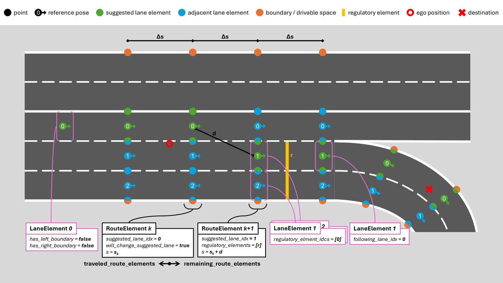

# Planning Interfaces

This repository provides a set of ROS packages (ROS *and* ROS 2) with common messages and tools relating to the behavior planning task of automated vehicles. The planning task here relates to the entire driving task time horizon, i.e., navigation, command, and stabilization level.

> [!IMPORTANT]  
> This repository is open-sourced and maintained by the [**Institute for Automotive Engineering (ika) at RWTH Aachen University**](https://www.ika.rwth-aachen.de/).  
> We cover a wide variety of research topics within our [*Vehicle Intelligence & Automated Driving*](https://www.ika.rwth-aachen.de/en/competences/fields-of-research/vehicle-intelligence-automated-driving.html) domain.  
> If you would like to learn more about how we can support your automated driving or robotics efforts, feel free to reach out to us!  
> :email: ***opensource@ika.rwth-aachen.de***

## Repository Structure

```
planning_interfaces
├── doc                                 # Doxygen documentation
├── route_planning_msgs                 # All navigation level .msg files
├── route_planning_rviz_plugins         # RViz plugins (displays, tools) for visualization of and interaction with the route_planning_msgs
├── tf2_route_planning_msgs             # Coordinate transformations for the route_planning_msgs
├── tf2_trajectory_planning_msgs        # Coordinate transformations for the trajectory_planning_msgs
├── trajectory_planning_msgs            # All command level .msg files
├── trajectory_planning_rviz_plugins    # RViz plugins (displays) for visualization of the trajectory_planning_msgs
└── trajectory_planning_msgs_utils      # Utility (access) functions for the trajectory_planning_msgs
```

## Background

Behavior planning is one central task in automated driving, responsible for making real-time decisions that guide the vehicle safely and efficiently through its environment. This includes tasks such as route planning or vehicle guidance across different time horizons. To ensure modularity and reusability, communication between planning components requires well-defined message interfaces.

While ROS already provides [common_interfaces](https://github.com/ros2/common_interfaces) for generic robotics applications, they do not cover the specific needs of behavior planning in automated driving. The `planning_interfaces` address this gap by defining standardized ROS messages for inter-module communication within the planning stack. These interfaces enable seamless data exchange between navigation, command, and stabilization levels, supporting flexible and scalable system architectures.

## Overview of the route_planning_msgs
The `route_planning_msgs` package contains message files related to the navigation task of automated driving. In principle, the following two use cases are covered by these message definitions:
1. Typical route planning tasks, where a route is planned from a start to an end point, including waypoints and time information. (e.g., Google Maps)
2. (Local) enrichement of a route with additional information, such as lane information, traffic signs, or adjacent lanes. (e.g., HD maps or camera-based lane detection)

The [`Route.msg`](route_planning_msgs/msg/Route.msg) contains the desired destination and two lists of ['RouteElements`](route_planning_msgs/msg/RouteElement.msg) (one for traveled and one for remaining). These `RouteElements` then contain information about the road topology, such as lanes, regulatory elements (e.g., traffic signs), and other relevant information. The following figure illustrates the key components of the `Route.msg`:




## Overview of the trajectory_planning_msgs

The `trajectory_planning_msgs` package contains a generic trajectory message format for automated driving applications. The message format is designed to be flexible and extensible, allowing for the representation of a wide range of trajectory types. For this purpose, the main information is stored in a generic [states](trajectory_planning_msgs/msg/Trajectory.msg#L10) vector of `float64`, which can be interpreted in different ways depending on the [type_id](trajectory_planning_msgs/msg/Trajectory.msg#L10). The `type_id` is used to identify the specific trajectory type and to determine how the `states` vector should be interpreted. This enables the representation of different trajectories, based on different state models, in a single message format.

Anyone can define and add their own trajectory type in a new message file under a new `type_id`. The trajectory type may contain all information relevant in a specific use case. Currently, the following trajectory types are supported:
- [REFERENCE.msg](trajectory_planning_msgs/msg/REFERENCE.msg): A reference trajectory, based on no specific state model, just a list of waypoints with time information.
- [DRIVABLE.msg](trajectory_planning_msgs/msg/DRIVABLE.msg): A drivable trajectory, based on the kinematic bicycle model with Ackermann steering.
- [DRIVABLERWS.msg](trajectory_planning_msgs/msg/DRIVABLERWS.msg): A drivable trajectory, based on the kinematic bicycle model with additional rear-wheel steering.

### Important:

The `uint8` fields below the states vector of a trajectory type define the index in the states vector under which a piece of information can be found. `uint8 X=0`, for example, indicates that the X position is at the 0th position in the vector, *not* that the X value is 0. The actual value in the vector is set in the code.

Also, note that the states vector contains multiple state instances, one for each time step of the trajectory. The number of states in the vector can be calculated by dividing the length of the states vector by the number of values in the state model ([STATE_DIM](trajectory_planning_msgs/msg/REFERENCE.msg#5)):
```cpp
// Example for the REFERENCE state model
number_of_states = states.size() / REFERENCE::STATE_DIM
```

Defining state vectors in this way allows us to do two things:

1. We do not need to know the location in the vector later when coding because we can access elements of the vector like this:
```cpp
    double x_0 = msg.states[REFERENCE::X];
    double x_1 = msg.states[REFERENCE::STATE_DIM + REFERENCE::X];
```

2. We may change the location of the X position in the vector by changing the state model without the need to change any code. We may still access the X position of the EGO vehicle like this:
```cpp
    double x_0 = msg.states[REFERENCE::X];
    double x_1 = msg.states[REFERENCE::STATE_DIM + REFERENCE::X];
```

This convenience comes at a cost, though. We are able to receive data via the state vector that does not adhere to our definition, and ROS would not be able to detect this out of the box because the checksums of the message files may still be identical. Changes in the state model definitions, especially reordering, should therefore be handled with extreme care!

### Access functions

Accessing the states of the trajectory message can be challenging, especially in C++, due to the flattened structure of the states vector. For this reason, with [trajectory_planning_msgs_utils](trajectory_planning_msgs_utils), we provide a ROS package with access functions defined in C++ header files. These enable developers to read and write fields of the trajectory_msgs more easily.

A list of all access functions can be found in [state_getters.h](trajectory_planning_msgs_utils/include/trajectory_planning_msgs_utils/impl/state_getters.h) and [state_setters.h](trajectory_planning_msgs_utils/include/trajectory_planning_msgs_utils/impl/state_setters.h).

In your C++ code, just include them like this:

```cpp
#include <trajectory_planning_msgs_utils/trajectory_access.hpp>
```

to use them. Example benefits include the ability to let the access functions automatically convert between quaternions and Euler angles or ensuring that, e.g., yaw angles always lie between -PI and +PI.

We recommend initializing it with [`initializeTrajectory()`](trajectory_planning_msgs_utils/include/trajectory_planning_msgs_utils/impl/init.h#L18). This ensures that the message is correctly initialized and that the states vector has the correct size. After that, you can fill the message with the desired information.

The API documentation for the object access functions can be found [here](https://ika-rwth-aachen.github.io/planning_interfaces).

## Coordinate Systems and Transformations

The coordinate system in which all subsequent fields of a message are given is defined in the top-level header, i.e., in [Trajectory.msg](trajectory_planning_msgs/msg/Trajectory.msg#L1) and [Route.msg](route_planning_msgs/msg/Route.msg#L1). Headers are a common ROS interface defined [here](https://github.com/ros2/common_interfaces/blob/rolling/std_msgs/msg/Header.msg). The definitions of the coordinate systems themselves may, for example, be determined by a [URDF](https://docs.ros.org/en/iron/Tutorials/Intermediate/URDF/URDF-Main.html) file.

Transformations between coordinate frames are often needed in robotics applications. The [tf2](http://wiki.ros.org/tf2) ROS package ([GitHub](https://github.com/ros2/geometry2)) provides many functions and tools related to coordinate frames and transformations. It is the de facto standard for related tasks in ROS. Since the package does not know how the message files in this repository are structured, we need to define functions that allow us to integrate our messages into the existing framework provided by the tf2 ROS package. For this purpose, we specifically need to write a specialized `doTransform()` function for our messages.

The implementation can be found in [tf2_trajectory_planning_msgs](tf2_trajectory_planning_msgs) and [tf2_route_planning_msgs](tf2_route_planning_msgs). Available implementations include all provided messages and state models.

## RViz Plugins

This repository provides the ROS packages [trajectory_planning_msgs_rviz_plugins](trajectory_planning_msgs_rviz_plugins) and [route_planning_msgs_rviz_plugins](route_planning_msgs_rviz_plugins) that, together, allow visualization of the `trajectory_planning_msgs` (including all state models) and the `route_planning_msgs` in RViz (only supported for ROS 2).

## Acknowledgements

This research is accomplished within the research projects ”[autotech.agil](https://www.autotechagil.de/)” (FKZ 1IS22088A), ”[UNICAR*agil*](https://www.unicaragil.de/en/)” (FKZ 16EMO0284K), ”[6GEM](https://www.6gem.de/en/)” (FKZ 16KISK036K), and ”[AIthena](https://aithena.eu/)” (Grant Agreement No. 101076754). We acknowledge the financial support by the Federal Ministry of Education and Research of Germany (BMBF) and by the European Union under its Horizon Europe funding programme for research and innovation.